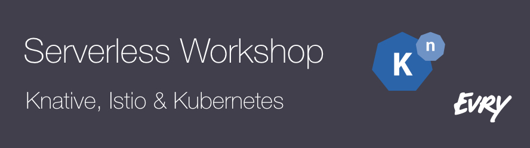

[Knative][knative] &amp; [Istio][istio] Workshop on Google Cloud and Google
Kubernetes Engine.

[knative]: https://www.knative.dev/
[istio]: https://istio.io/

## Knative

Knative (pronounced kay-nay-tiv) extends Kubernetes to provide a set of
middleware components that are essential to build modern, source-centric, and
container-based applications that can run anywhere: on premises, in the cloud,
or even in a third-party data center.

Each of the components under the Knative project attempt to identify common
patterns and codify the best practices that are shared by successful,
real-world, Kubernetes-based frameworks and applications. Knative components
focus on solving mundane but difficult tasks such as:

* [Deploying a container][knative-deploy]
* [Orchestrating source-to-URL workflows on Kubernetes][knative-workflows]
* [Routing and managing traffic with blue/green deployment][knative-bluegreen]
* [Scaling automatically and sizing workloads based on demand][knative-scaling]
* [Binding running services to eventing ecosystems][knative-eventing]

[knative-deploy]: https://www.knative.dev/docs/install/getting-started-knative-app
[knative-workflows]: https://www.knative.dev/docs/serving/samples/source-to-url-go/
[knative-bluegreen]: https://www.knative.dev/docs/serving/samples/blue-green-deployment
[knative-scaling]: https://www.knative.dev/docs/serving/samples/autoscale-go/
[knative-eventing]: https://www.knative.dev/docs/eventing/samples/kubernetes-event-source/

Developers on Knative can use familiar idioms, languages, and frameworks to
deploy functions, applications, or containers workloads.

### Components

The following Knative components are available:

* [Build][knative-build] - Source-to-container build orchestration
* [Eventing][knative-eventing] - Management and delivery of events
* [Serving][knative-serving] - Request-driven compute that can scale to zero

[knative-build]: https://www.knative.dev/docs/build/
[knative-serving]: https://www.knative.dev/docs/serving/
[knative-eventing]: https://www.knative.dev/docs/eventing/

## Lab Assignments

0. [Knative Setup](./labs/0-setup)
1. [Knative Serve](./labs/1-serve)
2. [Knative Build](./labs/2-build)
3. [Knative Events](./labs/3-events)
4. [Knative Guestbook](./labs/4-guestbook)
5. [Serverless Runtime](./labs/5-buildpack)

---

Except as otherwise noted, the content of this page is licensed under the
[Creative Commons Attribution 4.0 License][cc-by], and code samples are licensed
under the [Apache 2.0 License][apache-2-0].

[cc-by]: https://creativecommons.org/licenses/by/4.0/
[apache-2-0]: https://www.apache.org/licenses/LICENSE-2.0
